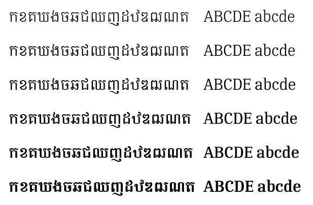
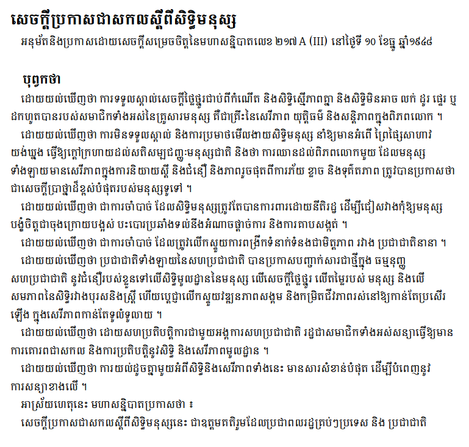

Six fonts for this typeface family are included in the *Busra* release:

- Busra ExtraLight
- Busra Light
- Busra Regular
- Busra Medium
- Busra SemiBold
- Busra Bold

## Type Samples

The Busra font supports the following Khmer characters:

កខគឃងចឆជឈញដឋឌឍណតថទធនបផពភមយរលវឝឞសហឡអឣឤឥឦឧឨឩឪឫឬឭឮឯឰឱឲ

	

ា ិ ី ឹ ឺ ុ ូ ួ ើ ឿ ៀ េ ែ ៃ ោ ៅ ំ ះ ៈ ៉   ៊ ់ ៌ ៍ ៎ ៏ ័ ៑ ្ ៓

០១២៣៤៥៦៧៨៩

	

។ ៕ ៖ ៗ ៘ ៙ ៚ ៛ ៜ ៝   ៰៱៲៳៴៵៶៸៹

	
The following shows the six weights:

An example of some text using Busra is shown below.

<figcaption>Busra sample - Universal Declaration of Human Rights</figcaption>

## Character Set

For a complete list of characters included in Busra, see [Character Set Support](charset.md).

## Font Features

Alternate glyphs that are available through features are demonstrated in the [Features](features.md) document.
